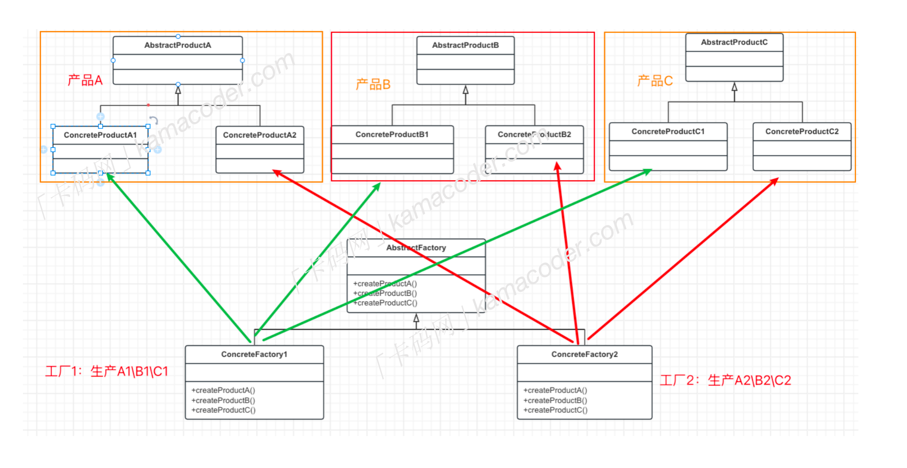

# 抽象工厂模式
--- 
### 什么是抽象工厂模式
抽象工厂模式是一种创建型设计模式，提供了一个创建一系列相关或相互依赖对象的接口，而无需指定它们具体的类。
抽象工厂模式可以确保一系列相关的产品被一起创建，这些产品能够相互配合使用，再举个例子，有一些家具，比如沙发、茶几、椅子，都具有古典风格的和现代风格的，抽象工厂模式可以将生产现代风格的家具放在一个工厂类中，将生产古典风格的家具放在另一个工厂类中，这样每个工厂类就可以生产一系列的家具。

### 基本结构
抽象工厂模式包含多个`抽象产品接口`，`多个具体产品类`，`一个抽象工厂接口`和`多个具体工厂`，每个具体工厂负责创建一组相关的产品。
- 抽象产品接口`AbstractProduct`：定义产品的接口，可以定义多个抽象产品接口，比如沙发、椅子、茶几都是抽象产品。
- 具体产品类`ConcreteProduct`:实现抽象产品的接口，产品的具体实现。
- 抽象工厂接口`AbstractFactory`：声明一组用于创建产品的方法，每个方法对应一个产品。
- 具体工厂类`CocreteFactory`：实现抽象工厂接口，负责创建一组具体产品的对象

### 应用场景
抽象工厂模式能够保证一系列相关的产品一起使用，并且在不修改客户端代码的情况下，可以方便的替换整个产品系列。但是当需要增加新的产品类时，除了要增加新的具体产品类，还需要修改抽象工厂方法接口及其所有的具体工厂类，扩展性相对较差。因此抽象工厂模式特备适合一系列相关或相互依赖的产品被一起创建的情况。典型的应用场景是使用抽象工厂模式来创建与不同数据库的连接对象。

### 简单工厂、工厂方法、抽象工厂的区别
- 简单工厂：一个工厂方法创建所有的具体产品
- 工厂方法模式：一个工厂方法创建一个具体产品
- 抽象工厂：一个工厂方法可以创建一类具体产品

