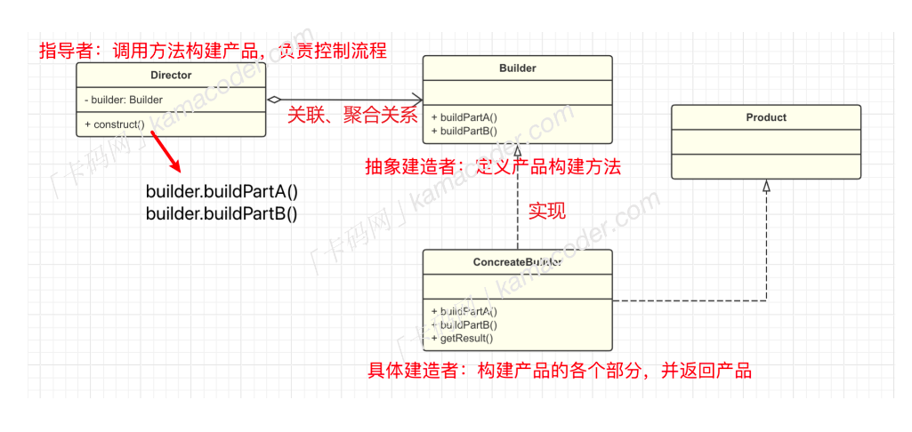

# 建造者模式


## 什么是建造者模式
建造者模式（生成器模式），是一种创建型设计模式，软件开发过程中软件开发过程中有的时候需要创建很复杂的对象，而建造者模式的主要思想是**将对象的构建过程分为多个步骤，并为每个步骤定义一个抽象的接口。具体的构建过程由实现了这些接口的具体建造者类来完成。**同时有一个指导者类负责协调建造者的工作，按照一定的顺序或逻辑来执行构建步骤，最终生成产品。

举个例子，假如我们要创建一个计算机对象，计算机由很多组件组成，例如 CPU、内存、硬盘、显卡等。每个组件可能有不同的型号、配置和制造，这个时候计算机就可以被视为一个复杂对象，构建过程相对复杂，而我们使用建造者模式将计算机的构建过程封装在一个具体的建造者类中，而指导者类则负责指导构建的步骤和顺序。每个具体的建造者类可以负责构建不同型号或配置的计算机，客户端代码可以通过选择不同的建造者来创建不同类型的计算机，这样就可以根据需要构建不同表示的复杂对象，更加灵活。

## 基本结构
建造者模式有下面几个关键角色：

- 产品`Product`：被构建的复杂对象，包含多个组成部分。
- 抽象建造者`Builder`：定义构建产各个部分的抽象接口和一个返回复杂产品的方法`getRusult`
- 具体建造者`Concrete Builder`:实现抽象建造者接口，构建产品的各个组成部分，并提供一个方法返回最终的产品。
- 指导者`Director`：调用具体建造者的方法，按照一定的顺序或逻辑来构建产品。

>在客户端中，通过指导者来构建产品，而并不和具体建造者进行直接的交互。

>

## 使用场景
使用建造者模式有下面几处优点：

- 使用建造者模式可以将一个复杂对象的构建与其表示分离，**通过将构建复杂对象的过程抽象出来，可以使客户端代码与具体的构建过程解耦。
- **同样的构建过程可以创建不同的表示**，可以有多个具体的建造者（相互独立）,可以更加灵活地创建不同组合的对象。

对应的，建造者模式适用于复杂对象的创建，当对象构建过程相对复杂时可以考虑使用建造者模式，但是当产品的构建过程发生变化时，可能需要同时修改指导类和建造者类，这就使得重构变得相对困难。

建造者模式在现有的工具和库中也有着广泛的应用，比如JUnit 中的测试构建器TestBuilder就采用了建造者模式，用于构建测试对象。

### 示例代码
```c++
#include <iostream>
#include <string>
 
// 自行车产品
class Bike {
public:
    std::string frame;
    std::string tires;
 
    void setFrame(const std::string& frame) {
        this->frame = frame;
    }
 
    void setTires(const std::string& tires) {
        this->tires = tires;
    }
 
    friend std::ostream& operator<<(std::ostream& os, const Bike& bike) {
        os << bike.frame << " " << bike.tires;
        return os;
    }
};
 
// 自行车建造者接口
class BikeBuilder {
public:
    virtual void buildFrame() = 0;
    virtual void buildTires() = 0;
    virtual Bike getResult() = 0;
};
 
// 山地自行车建造者
class MountainBikeBuilder : public BikeBuilder {
private:
    Bike bike;
 
public:
    void buildFrame() override {
        bike.setFrame("Aluminum Frame");
    }
 
    void buildTires() override {
        bike.setTires("Knobby Tires");
    }
 
    Bike getResult() override {
        return bike;
    }
};
 
// 公路自行车建造者
class RoadBikeBuilder : public BikeBuilder {
private:
    Bike bike;
 
public:
    void buildFrame() override {
        bike.setFrame("Carbon Frame");
    }
 
    void buildTires() override {
        bike.setTires("Slim Tires");
    }
 
    Bike getResult() override {
        return bike;
    }
};
 
// 自行车Director，负责构建自行车
class BikeDirector {
public:
    Bike construct(BikeBuilder& builder) {
        builder.buildFrame();
        builder.buildTires();
        return builder.getResult();
    }
};
 
int main() {
    int N;
    std::cin >> N;  // 订单数量
 
    BikeDirector director;
 
    for (int i = 0; i < N; i++) {
        std::string bikeType;
        std::cin >> bikeType;
 
        BikeBuilder* builder;
 
        // 根据输入类别，创建不同类型的具体建造者
        if (bikeType == "mountain") {
            builder = new MountainBikeBuilder();
        } else {
            builder = new RoadBikeBuilder();
        }
 
        // Director负责指导生产产品
        Bike bike = director.construct(*builder);
        std::cout << bike << std::endl;
 
        // 释放动态分配的对象
        delete builder;
    }
 
    return 0;
}


```
