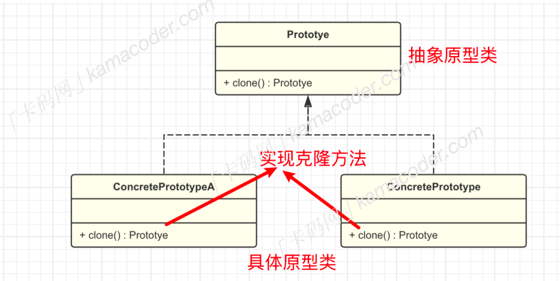

# 原型模式

---

## 什么是原型模式？

原型模式也是一种`创建型设计模式`,该模式的核心思想是基于现有对象创建新的对象，而不是从头开始创建。
在原型模式中，通常有一个原型对象，它被用作创建新对象的模板。新对象通过复制原型对象的属性和状态来创建，而无需知道具体的创建细节。

## 为什么要使用原型模式？

如果一个对象的创建过程比较复杂时，（比如需要经过一系列的计算和资源消耗），那每次创建该对象都需要消耗资源，而通过原型模式就可以复制现有的一个对象来迅速创建/克隆一个新对象，不必关心具体的创建细节，可以降低对象创建的成本。

## 原型对象的基本结构

实现原型模式需要给【原型对象】声明一个克隆方法`clone`，该方法会创建一个当前类的对象，并将原始的对象成员变量复制到新生成的对象中，而不必实例化。并且在这个过程中，只需要调用原型对象的克隆方法，而无需知道原型对象的具体类型。

原型模式包含两个重点模块：

- 抽象原型接口`prototype`:声明一个克隆自身的方法
- 具体原型类`concretePrototype`:实现`clone`方法，复制当前对象并返回一个新对象。

在客户端代码中，可以声明一个具体原型类的对象，然后调用`clone`方法赋值源对象生成一个新的对象。


---

## 什么时候实现原型模式？

相比于直接实例化对象，通过原型模式复制对象可以减少资源消耗。尤其在对象的创建过程复杂或对象的创建代价较大的情况下。当需要频繁创建相似对象、并且可以通过克隆避免重复初始化工作的场景时可以考虑使用原型模式，在克隆对象的时候还可以动态地添加或删除原型对象的属性，创造出相似但不完全相同的对象，提高了灵活性。

但是使用原型模式也需要考虑到如果对象的内部状态包含了引用类型的成员变量，那么实现深拷贝就会变得较为复杂，需要考虑引用类型对象的克隆问题。尤其在对象的创建过程复杂或对象的创建代价较大的情况下。当需要频繁创建相似对象、并且可以通过克隆避免重复初始化工作的场景时可以考虑使用原型模式，在克隆对象的时候还可以动态地添加或删除原型对象的属性，创造出相似但不完全相同的对象，提高了灵活性。

但是使用原型模式也需要考虑到如果对象的内部状态包含了引用类型的成员变量，那么实现深拷贝就会变得较为复杂，需要考虑引用类型对象的克隆问题。

---

>## 代码实现 🚀

``` c++
#include <iostream>
#include <string>
#include <vector>
using namespace std;

// 抽象原型类
class Prototype
{
public:
    virtual Prototype *clone() const = 0;
    virtual string getDetails() const = 0;
    virtual ~Prototype(){};
};

// 具体矩形原型类
class RtanglePrototype : public Prototype
{
private:
    string color;
    int width;
    int height;

public:
    // 构造方法
    RtanglePrototype(string color, int width, int height) : color(color), width(width), height(height) {}

    // 克隆方法
    Prototype *clone() const override
    {
        // this指针指向当前对象  *this通过间接访问  表示该对象引用。
        return new RtanglePrototype(*this);
    }

    // 获取矩形的详细信息
    string getDetails() const override
    {
        return "color:" + color + ", Width: " + std::to_string(width) + ", Height: " + std::to_string(height);
    }
};

// 客户端程序
int main()
{
    vector<Prototype *> retangles;

    // 读取时需要创建的矩形数量
    int N;
    cin>>N;
    for (auto i = 0; i < N; i++)
    {
        string color;
        int height;
        int width;
        cin >> color >> width >> height;
        // 创建原型对象
        Prototype *originalRetangle = new RtanglePrototype(color, width, height);

        // 将原型对象保存到向量中
        retangles.push_back(originalRetangle);
    }

    for (const auto &rectangle : retangles)
    {
        Prototype *cloneRetangle = rectangle->clone();
        cout << cloneRetangle->getDetails() << endl;

        // 释放克隆对象的内存
        delete cloneRetangle;
    }

    // 释放原型对象的内存
    for (const auto &retangle : retangles)
    {
        delete retangle;
    }
    return 0;
}


```
