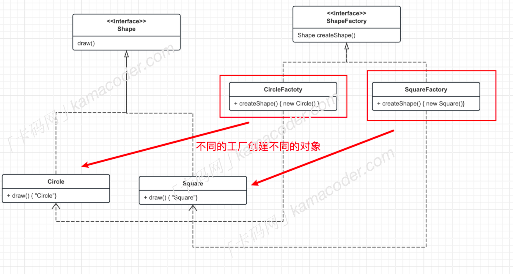

# 什么是工厂方法模式
工厂方法模式是一种创建型设计模式，简单工厂模式只有一个工厂类，负责创建所有的产品，如果要添加新的产品，通常需要修改工厂类的代码。而工厂方法模式引入了抽象工厂和具体工厂的概念，每个具体工厂只负责创建一个具体产品，添加新的产品只需要添加新的工厂类而不需要修改原来的代码，这样使得产品的生产更加灵活，支持扩展，符合开闭原则。
工厂方法分为以下几个角色：
- 抽象工厂：一个接口，包含一个抽象的工厂方法（用于创建产品对象）
- 具体工厂：实现抽象工厂接口，创建具体的产品
- 抽象产品：定义产品的接口
- 具体产品：实现抽象产品接口，是工厂创建的对象。

实际上工厂方法很好理解，拿`iphone`手机举例，手机是一个抽象产品，小米手机，华为手机，苹果手机是具体的产品实现，而不同品牌的手机在不同的生产产家生产。


# 应用场景
工厂方法使得每个工厂类的职责单一，每个工厂只负责创建一种产品，当创建对象涉及一些列复杂的初始化逻辑，而这些逻辑在不同的子类中可能有不同时，可以使用工厂方法模式将这些逻辑各异的初始化操作封装在子类的工厂中。

`代码如下`
```
#include <iostream>
#include <vector>

// 抽象积木接口
class Block
{
public:
    virtual void produce() = 0;
};

// 具体原型积木实现
class CircleBlock : public Block
{
public:
    void produce() override
    {
        std::cout << "this is CircleBlock" << std::endl;
    }
};

// 具体方形积木实现
class SquareBlock : public Block
{
public:
    void produce() override
    {
        std::cout << "this is squareblock" << std::endl;
    }
};

// 抽象积木工厂接口
class BlockFactory
{
public:
    virtual Block *createBlock() = 0;
};

// 具体圆型积木工厂实现
class CirleBlockFactory : public BlockFactory
{
    Block *createBlock() override
    {
        return new CircleBlock();
    }
};

// 具体方形积木工厂实现
class SquareBlockFactory : public BlockFactory
{
    Block *createBlock() override
    {
        return new SquareBlock();
    }
};

// 积木工厂系统
class BlockFactorySystem
{
private:
    std::vector<Block *> blocks;

public:
    void produceBlocks(BlockFactory *factory, int quantity)
    {
        for (int i = 0; i < quantity; i++)
        {
            Block *block = factory->createBlock();
            blocks.push_back(block);
            block->produce();
        }
    }

    const std::vector<Block *> &getBlocks() const
    {
        return blocks;
    }

    ~BlockFactorySystem()
    {
        // 释放所有动态分配的内存
        for (Block *block : blocks)
        {
            delete block;
        }
    }
};

int main()
{
    // 创建积木工厂系统
    BlockFactorySystem factorySystem;
    // 读取生产次数
    int productCount;
    std::cin >> productCount;

    for (int i = 0; i < productCount; i++)
    {
        std::string blockType;
        int quantity;
        std::cin >> blockType >> quantity;

        if (blockType == "circle")
        {
            factorySystem.produceBlocks(new CirleBlockFactory, quantity);
        }
        else if (blockType == "Square")
        {
            factorySystem.produceBlocks(new SquareBlockFactory(), quantity);
        }
    }
    return 0;
}
```