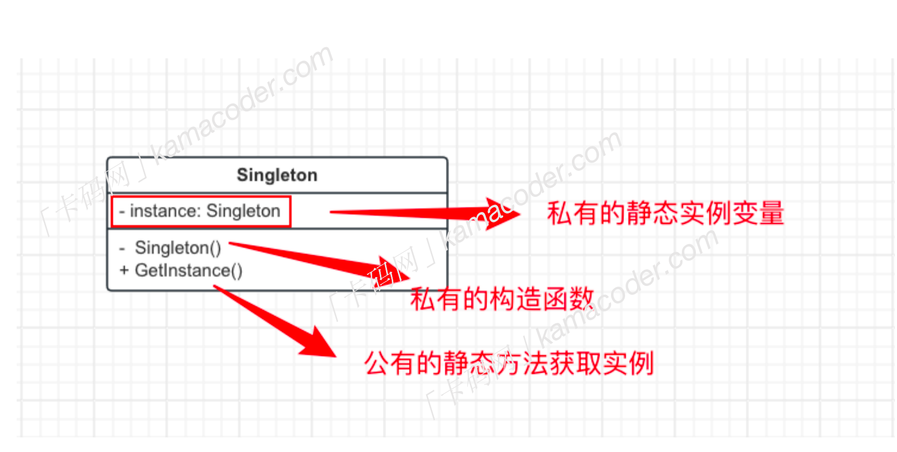

# 单例模式
## 什么是单例设计模式

单例设计模式是一种**创建型设计模式**，他的核心思想是保证**一个类只有一个实例，并提供一个全局访问点来访问这个实例**。
- 只有一个实例的意思是：在整个应用程序中，只存在该类的一个实例对象，而不是创建多个相同类型的对象。
- 全局访问点的意思是：为了让其他类能够获取到这个唯一实例，该类提供了一个全局访问点（通常是一个静态方法），通过该方法就能获得实例。

## 为什么要用单例设计模式？
简单来说，有一下几个优点：
- 全局控制：保证只有一个实例，保证只有一个实例，这样就可以严格的控制客户怎样访问它以及何时访问它，简单的说就是对唯一实例的受控访问
- 节省资源：也正是因为只有一个实例存在，就避免多次创建了相同的对象，从而节省了系统资源，而且多个模块还可以通过单例实例共享数据。
- 懒加载：单例模式可以实现懒加载，只有在需要时才进行实例化，这无疑会提高程序的性能。


## 单例设计模式的基本要求
- 私有的构造函数：放置外部代码直接创建类的实例。
- 私有的静态实例变量：保存该类的唯一实例。
- 公有的静态方法：通过公有的静态方法来获取类的实例。

 ## 单例设计模式的实现
 单例设计模式有很多种，包括懒汉式，饿汉式。
 - 饿汉式：指在***类加载的时候就已经完成了实例的创建***，不管后面创建的实例有没有使用，先创建再说（所谓的操之过急）
 - 懒汉式：只有在请求实例时才会创建，如果在首次请求时候还未创建，则创建一个新的实例，但若已经创建，则返回已存在的实例，意思是***需要的时候再创建***，故称懒汉。
```c++代码如下```
```
#include <iostream>
#include <map>
using namespace std;
class ShoppingCarManager
{
public:
    // get instace of shopping car
    static ShoppingCarManager &get_Instance()
    {
        // instance为静态全局变量 只会被初始化一次 即第一次创建的时候.
        static ShoppingCarManager instance;
        return instance;
    }
    // add goods into shopping cart
    void addToCart(const string &itemName, int nums)
    {
        cart[itemName] += nums;
    }

    // view the shoppin cart
    // 常成员函数，表示本能修改人了类成员的值
    void viewCart() const
    {
        for (const auto &item : cart)
        {
            cout << item.first << " " << item.second << endl;
        }
    }

private:
    // 私有的构造函数
    ShoppingCarManager(){};
    // the map of the item and nums in cart
    map<string, int> cart;
};

int main()
{
    string itemName;
    int quanlity;

    while (cin >> itemName >> quanlity)
    {
        ShoppingCarManager &cart = ShoppingCarManager::get_Instance();
        cart.addToCart(itemName, quanlity);
    }
    const ShoppingCarManager &cart = ShoppingCarManager::get_Instance();
    cart.viewCart();
    return 0;
}
```