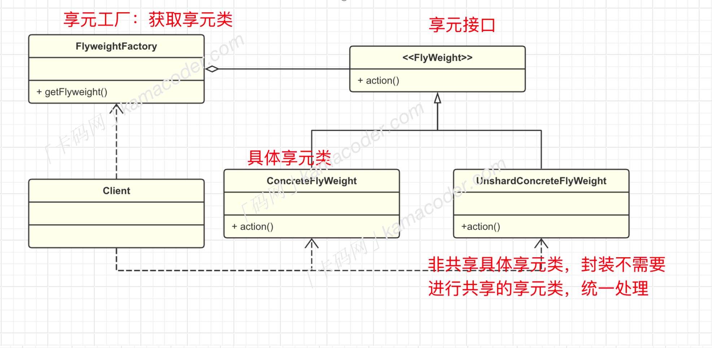

# 享元模式
## 基础概念
享元模式是一种结构型设计模式，在享元模式中，对象被设计为可共享的，可以被多个上下文使用，而不必在每个上下文中都创建新的对象。
想要了解享元模式，就必须要区分什么是内部状态，什么是外部状态。
- 内部状态是指那些可以被多个对象共享的状态，它存储在享元对象内部，并且对于所有享元对象都是相同的，这部分状态通常是不变的。
- 而外部状态是享元对象依赖的、可能变化的部分。这部分状态不存储在享元对象内部，而是在使用享元对象时通过参数传递给对象。
举个例子，图书馆中有很多相同书籍，但是每本书都可以被多个人借阅，图书馆里的书就是内部状态，人就是外部状态。
再举个开发中的例子，假设我们在构建一个简单的图形编辑器，用户可以在画布上绘制不同类型的图形，而图形就是所有图形对象的内部状态（不变的），而图形的坐标位置就是图形对象的外部状态（变化的）。

如果图形编辑器中有成千上万的图形对象，每个图形对象都独立创建并存储其内部状态，那么系统内存占用可能就会很大，在这种情况下，享元模式共享相同类型的图形对象，每种类型的图形对象只需要创建一个共享实例，然后通过设置不同的坐标位置个性化每个对象，通过共享相同的内部状态，降低了对象的创建和内存占用成本。

- 基本结构
享元模式包括一下几个重要角色：

- 享元接口`Flyweight:`所有具体享元类的接口，通常包含对外部对象状态的惭怍。

- 具体享元类`ConcreteFlyweight`:继承`Flyweight` 类或者实现享元接口，包含内部状态。
- 享元工厂类`FlyweightFactory`：创建并管理享元对象，当用户请求时候，提供已创建的实例或新创建一个。
- 客户端`Client`:维护外部状态，在使用享元对象时，将外部状态传递给享元对象。

## 使用场景
使用享元模式关键在于包含大量相似对象，并且这些对象的内部状态可以共享。具体的应用场景包括文本编辑器、图形编辑器、游戏中的角色创建，这些对象的内部状态比较固定（外观、技能、形状），但是外部状态变化比较大时，可以使用。


> ## 代码实例
```cpp
#include <iostream>
#include <unordered_map>
#include <sstream>
#include <string>

enum ShapeType {
    CIRCLE, RECTANGLE, TRIANGLE
};

std::string shapeTypeToString(ShapeType type) {
    switch (type) {
        case CIRCLE:
            return "CIRCLE";
        case RECTANGLE:
            return "RECTANGLE";
        case TRIANGLE:
            return "TRIANGLE";
        default:
            return "UNKNOWN";
    }
}

class Position {
private:
    int x;
    int y;

public:
    Position(int x, int y) : x(x), y(y) {}

    int getX() const {
        return x;
    }

    int getY() const {
        return y;
    }
};

class Shape {
public:
    virtual void draw(const Position &position) = 0;
    virtual ~Shape() {}
};

class ConcreteShape : public Shape {
private:
    ShapeType shapeType;
    bool isFirstTime;

public:
    ConcreteShape(ShapeType shapeType) : shapeType(shapeType), isFirstTime(true) {}

    void draw(const Position &position) override {
        std::cout << shapeTypeToString(shapeType) << (isFirstTime ? " drawn" : " shared") << " at (" << position.getX() << ", " << position.getY() << ")\n";
    }

    void setFirstTime(bool firstTime) {
        isFirstTime = firstTime;
    }
};

class ShapeFactory {
private:
    std::unordered_map<ShapeType, Shape *> shapes;

public:
    Shape *getShape(ShapeType type) {
        if (shapes.find(type) == shapes.end()) {
            shapes[type] = new ConcreteShape(type);
        }
        return shapes[type];
    }

    ~ShapeFactory() {
        for (const auto &entry : shapes) {
            delete entry.second;
        }
    }
};

void processCommand(ShapeFactory &factory, const std::string &command);

int main() {
    ShapeFactory factory;
    std::string command;

    while (std::getline(std::cin, command)) {
        processCommand(factory, command);
    }

    return 0;
}

void processCommand(ShapeFactory &factory, const std::string &command) {
    std::istringstream iss(command);
    std::string shapeTypeStr;
    int x, y;

    iss >> shapeTypeStr >> x >> y;

    ShapeType type;
    if (shapeTypeStr == "CIRCLE") {
        type = CIRCLE;
    } else if (shapeTypeStr == "RECTANGLE") {
        type = RECTANGLE;
    } else if (shapeTypeStr == "TRIANGLE") {
        type = TRIANGLE;
    } else {
        std::cerr << "Invalid shape type: " << shapeTypeStr << std::endl;
        return;
    }

    Shape *shape = factory.getShape(type);
    shape->draw(Position(x, y));
    dynamic_cast<ConcreteShape *>(shape)->setFirstTime(false);
}

```