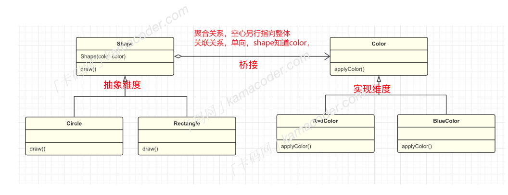
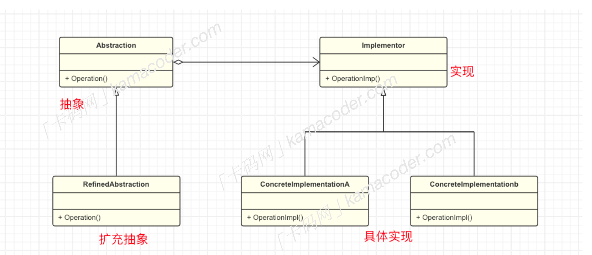

# 桥接模式
---
## 基本概念
桥接模式是一种结构型设计模式，它通过将【抽象部分】和【实现部分】分离，使它们可以独立变化，从而达到降低系统耦合度的目的。桥接模式的主要目的是通过组合建立两个类之间的联系，而不是继承的方式。

具体例子，图形编辑器中，每一种图形都需要蓝色、红色、黄色不同的颜色，如果不适用桥接模式，可能需要为每一种图形类型和每一种颜色都创建一个具体的子类，而使用桥接模式可以将图形和颜色两个维度分离，两个维度都可以独立的进行变化和扩展，如果要新增其他颜色，只需添加新的`color`子类，不影响图形类，反之亦然。


## 基本结构
桥接模式的基本结构分为一下几个角色：
- 抽象`Abstraction`:一般是抽象类，定义抽象部分的接口，维护一个对【实现】的引用。
- 修正抽象`refineAbstraction`:对抽象接口进行扩展，通常是对抽象化的不同维度进行变化或者定制。
- 实现`Implementor`:定义实现部分的接口，提供具体的实现，这个接口通常是抽象化接口的实现。
- 具体实现`concreteImplementor`:实现接口的具体类。这些负责实现接口定义的具体操作。


再举个例子，遥控器就是抽象接口，它具有开关电视的功能，修正抽象就是遥控器的实例，对遥控器的功能进行实现和扩展，而电视就是实现接口，具体品牌的电视机是具体实现，遥控器中包含一个对电视接口的引用，通过这种歌方式，遥控器和电视的实现可以被分离，我们可以创建多个遥控器，每个遥控器控制一个品牌的计算机，她们之间具有独立操作，不受电视品牌的影响，可以独立化。

## 使用场景
桥接模式在日常开发中使用并不是特别多，通常在以下情况下使用：
- 当一个类存在两个独立变化的维度，而且这两个维度都需要进行扩展时候，使用桥接模式可以使它们独立变化，减少耦合。
- 不希望使用继承，或继承导致类爆炸性增长
总体而言，桥接模式适用于那些有多个独立变化维度，需要灵活扩展的系统。

>## 代码示例
```c++
#include <iostream>
#include <sstream>
#include <vector>

// 步骤1: 创建实现化接口
class TV {
public:
    virtual void turnOn() = 0;
    virtual void turnOff() = 0;
    virtual void switchChannel() = 0;
};

// 步骤2: 创建具体实现化类
class SonyTV : public TV {
public:
    void turnOn() override {
        std::cout << "Sony TV is ON" << std::endl;
    }

    void turnOff() override {
        std::cout << "Sony TV is OFF" << std::endl;
    }

    void switchChannel() override {
        std::cout << "Switching Sony TV channel" << std::endl;
    }
};

class TCLTV : public TV {
public:
    void turnOn() override {
        std::cout << "TCL TV is ON" << std::endl;
    }

    void turnOff() override {
        std::cout << "TCL TV is OFF" << std::endl;
    }

    void switchChannel() override {
        std::cout << "Switching TCL TV channel" << std::endl;
    }
};

// 步骤3: 创建抽象化接口
class RemoteControl {
protected:
    TV* tv;

public:
    RemoteControl(TV* tv) : tv(tv) {}

    virtual void performOperation() = 0;
};

// 步骤4: 创建扩充抽象化类
class PowerOperation : public RemoteControl {
public:
    PowerOperation(TV* tv) : RemoteControl(tv) {}

    void performOperation() override {
        tv->turnOn();
    }
};

class OffOperation : public RemoteControl {
public:
    OffOperation(TV* tv) : RemoteControl(tv) {}

    void performOperation() override {
        tv->turnOff();
    }
};

class ChannelSwitchOperation : public RemoteControl {
public:
    ChannelSwitchOperation(TV* tv) : RemoteControl(tv) {}

    void performOperation() override {
        tv->switchChannel();
    }
};

// 步骤5: 客户端代码
int main() {
    int N;
    std::cin >> N;
    std::cin.ignore(); 

    for (int i = 0; i < N; i++) {
        std::string input;
        std::getline(std::cin, input);
        std::istringstream iss(input);
        
        int brand, operation;
        iss >> brand >> operation;

        TV* tv;
        if (brand == 0) {
            tv = new SonyTV();
        } else {
            tv = new TCLTV();
        }

        RemoteControl* remoteControl;
        if (operation == 2) {
            remoteControl = new PowerOperation(tv);
        } else if (operation == 3) {
            remoteControl = new OffOperation(tv);
        } else {
            remoteControl = new ChannelSwitchOperation(tv);
        }

        remoteControl->performOperation();

        delete tv;
        delete remoteControl;
    }

    return 0;
}


```