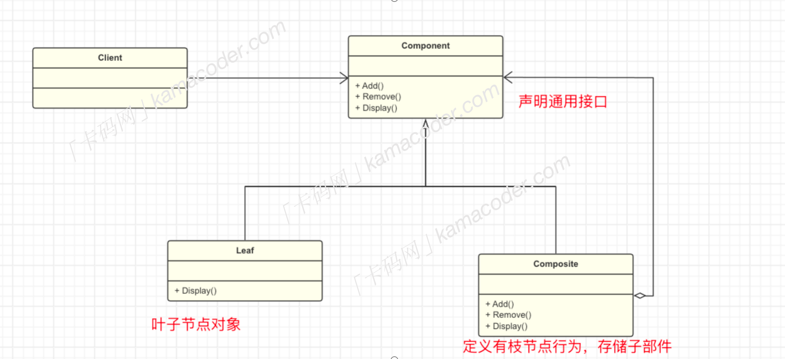

# 组合模式
## 基本概念
组合模式是一种结构型设计模式，它将***对象组合成树状结构***来表示`部分-整体`的层次关系。组合模式使得客户端可以统一处理单个对象和对象的组合，而无需区分它们的具体类型。

## 基本结构
组合模式包括以下几个角色：

举例：我们用“省份-城市”举个例子，省份中包含了多个城市，如果将之比喻成一个树形结构，城市就是叶子节点，它是省份的组成部分，而“省份”就是合成节点，可以包含其他城市，形成一个整体，省份和城市都是组件，它们都有一个共同的操作，比如获取信息。
- `Component`组件:组合模式的根节点，定义组合中所有对象的通用接口，可以使抽象类或接口。该类中定义了子类的共性内容。
- `Leaf`叶子：实现了Component接口的叶子节点，表示组合中的叶子对象，叶子结点没有子节点。
- `Composite合成`：作用是存储子部件，并在composite中实现了对子部件的相关操作，如添加、删除、获取子组件等。
通过组合模式，整个省份的获取信息操作都可以一次性的执行，而无需关心省份中的具体城市。这样就实现了对国家省份和城市的统一管理和操作。

## 使用场景
组合模式可以使得客户端可以统一处理单个对象和组合对象，无需区分她们之间的差异，如在图形编辑器中，图形对象可以是简单的线、圆形，也可以是-*组合*-的复杂图形，客户端可以统一处理。

总的来说，组合模式模式适合于任何需要构建具有部分-整体层次结构的场景，比如组织架构管理，文件系统的文件和文件夹组织等。

>## 代码示例：
```c++

#include <iostream>
#include <vector>
#include <sstream>

class Component {
public:
    virtual void display(int depth) = 0;
};

class Department : public Component {
private:
    std::string name;
    std::vector<Component*> children;

public:
    Department(const std::string& name) : name(name) {}

    void add(Component* component) {
        children.push_back(component);
    }

    void display(int depth) override {
        std::string indent(depth * 2, ' ');
        std::cout << indent << name << std::endl;
        for (Component* component : children) {
            component->display(depth + 1);
        }
    }
};

class Employee : public Component {
private:
    std::string name;

public:
    Employee(const std::string& name) : name(name) {}

    void display(int depth) override {
        std::string indent((depth + 1) * 2, ' ');
        std::cout << indent << name << std::endl;
    }
};

class Company {
private:
    std::string name;
    Department* root;

public:
    Company(const std::string& name) : name(name), root(new Department(name)) {}

    void add(Component* component) {
        root->add(component);
    }

    void display() {
        std::cout << "Company Structure:" << std::endl;
        root->display(0);
    }
};

int main() {
    std::string companyName;
    std::getline(std::cin, companyName);

    Company company(companyName);

    int n;
    std::cin >> n;
    std::cin.ignore(); 
    for (int i = 0; i < n; i++) {
        std::string type, name;
        std::cin >> type;
        std::getline(std::cin >> std::ws, name);

        if (type == "D") {
            Department* department = new Department(name);
            company.add(department);
        } else if (type == "E") {
            Employee* employee = new Employee(name);
            company.add(employee);
        }
    }

    company.display();

    return 0;
}


```