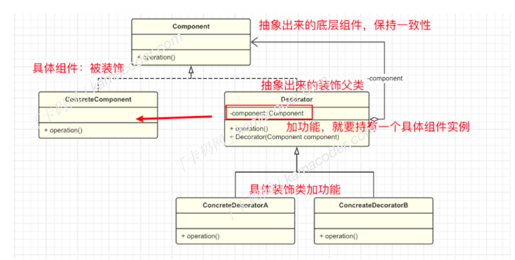

# 装饰模式
## 基本概念
通常情况下，扩展类的功能可以通过继承实现，但是扩展越多，子类越多，装饰模式可以在不予**不定义子类的情况下动态的来给对象添加一些额外的功能**，***具体做法是将原始的对象放入包含行为的特殊封装类（装饰类），从而为原始对象添加新的行为，而无需修改其代码***。

举个简单的例子，假设你有个基础的图形类，你要为图形类添加颜色，边框、阴影等功能，如果每个功能都实现一个子类，就会产生大量的类，这时就可以考虑使用装饰模式来动态的添加，而不需要修改图形类本身的代码，这样可以使得代码更加灵活、易维护、扩展。


## 基本结构
装饰模式包含以下几个主要角色：


- 组件`Component`:通常是抽象类或者接口，是具体组件和装饰者的父亲，定义了具体组件需要实现的方法，比如我们定义`coffee`为组件。
- 具体组件`ConcretComponent`:实现了Component接口的具体类，是被**装饰的对象**
- 装饰类`Decorator：`一个抽象类，给具体组件添加功能，但是具体的功能由其子类具体装饰者完成。持有一个指向`Component`对象的引用。
- 具体装饰类`ConcreteDecorator:`扩展Decorator类，负责向component对象添加新的行为，加牛奶咖啡是一个具体装饰类，加糖的咖啡也是一个具体装饰类。

## 应用场景
装饰模式通常应用在以下几种情况：
- 当需要给一个现有类添加附加功能，但由于某些原因不能使用继承来生成子类进行扩充时，可以使用装饰模式。
- 动态的添加和覆盖功能：当对象的功能要求可以动态的添加，也可以再动态地撤销时可以使用装饰模式。

>### 代码实现
```c++

#include <iostream>
#include <memory>

// 咖啡接口
class Coffee {
public:
    virtual ~Coffee() {}
    virtual void brew() = 0;
};

// 具体的黑咖啡类
class BlackCoffee : public Coffee {
public:
    void brew() override {
        std::cout << "Brewing Black Coffee" << std::endl;
    }
};

// 具体的拿铁类
class Latte : public Coffee {
public:
    void brew() override {
        std::cout << "Brewing Latte" << std::endl;
    }
};

// 装饰者抽象类
class Decorator : public Coffee {
protected:
    std::unique_ptr<Coffee> coffee;

public:
    Decorator(std::unique_ptr<Coffee> coffee) : coffee(std::move(coffee)) {}

    void brew() override {
        if (coffee) {
            coffee->brew();
        }
    }
};

// 具体的牛奶装饰者类
class MilkDecorator : public Decorator {
public:
    MilkDecorator(std::unique_ptr<Coffee> coffee) : Decorator(std::move(coffee)) {}

    void brew() override {
        Decorator::brew();
        std::cout << "Adding Milk" << std::endl;
    }
};

// 具体的糖装饰者类
class SugarDecorator : public Decorator {
public:
    SugarDecorator(std::unique_ptr<Coffee> coffee) : Decorator(std::move(coffee)) {}

    void brew() override {
        Decorator::brew();
        std::cout << "Adding Sugar" << std::endl;
    }
};

// 客户端代码
int main() {
    int coffeeType, condimentType;
    while (std::cin >> coffeeType >> condimentType) {
        // 根据输入制作咖啡
        std::unique_ptr<Coffee> coffee;

        if (coffeeType == 1) {
            coffee = std::make_unique<BlackCoffee>();
        } else if (coffeeType == 2) {
            coffee = std::make_unique<Latte>();
        } else {
            std::cout << "Invalid coffee type" << std::endl;
            continue;
        }

        // 根据输入添加调料
        if (condimentType == 1) {
            coffee = std::make_unique<MilkDecorator>(std::move(coffee));
        } else if (condimentType == 2) {
            coffee = std::make_unique<SugarDecorator>(std::move(coffee));
        } else {
            std::cout << "Invalid condiment type" << std::endl;
            continue;
        }

        // 输出制作过程
        coffee->brew();
    }

    return 0;
}


```