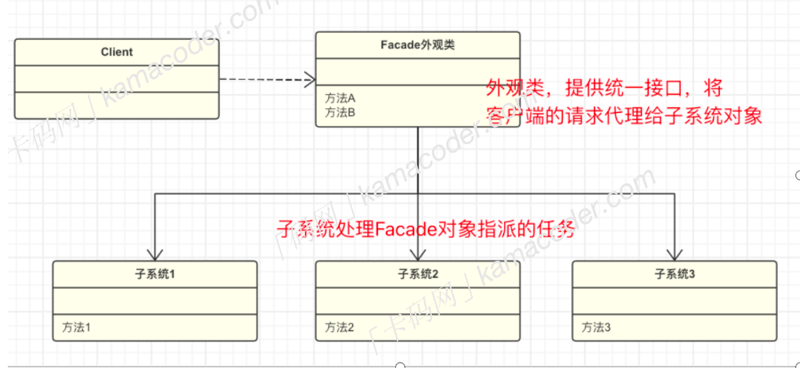

# 外观模式
## 基本概念
外观模式`facade pattern`,也被成为门面模式，诗意中国结构型设计模式，外观模式定义了一个高层接口，这个接口使得子系统更容易使用，同时也隐藏了子系统的复杂性。
>门面模式可以将子系统关在门丽隐藏起来，客户端只需要通过外观接口与外观对象进行交互，而不需要直接和多个子系统交互，无论子系统多么复杂，对于外部来说都是隐藏的，这样可以降低系统的耦合度。

举个例子，假设你正在编写一个模块用于处理文件读取、解析、存储，我们可以将这个过程拆分为三部分，然后创建一个外观类，将文件系统操作、数据解析、存储操作封装在外观类中，为客户端提供一个简化的接口，如果后续需要修改文件处理的流程或替换底层子系统，也只需要在外观类中进行调整，不会影响客户端代码。

## 基本结构
外观模式的基本结构比较简单，只包括外观和子系统类

- 外观类：对外提供一个高层次的接口，是复杂的子系统变得更易使用
- 子系统类：实现子系统的功能，处理外观类指派的任务。


## 优缺点和使用场景
外观模式通过提供一个简化的接口，隐藏了系统的复杂性，降低了客户端和子系统之间的耦合度，客户端不需要了解系统的内部实现细节，也不需要直接和多个子系统交互，只需要通过外观接口与外观对象进行加交互。
但如果需要添加新的子系统或者修改子系统的行为，就可能需要修改外观类，这就违背了开闭原则。


>### 代码实现
```c++
#include <iostream>
#include <vector>

class AirConditioner {
public:
    void turnOff() {
        std::cout << "Air Conditioner is turned off." << std::endl;
    }
};

class DeskLamp {
public:
    void turnOff() {
        std::cout << "Desk Lamp is turned off." << std::endl;
    }
};

class Television {
public:
    void turnOff() {
        std::cout << "Television is turned off." << std::endl;
    }
};

class PowerSwitchFacade {
private:
    DeskLamp deskLamp;
    AirConditioner airConditioner;
    Television television;

public:
    PowerSwitchFacade() {
    }

    void turnOffDevice(int deviceCode) {
        switch (deviceCode) {
            case 1:
                airConditioner.turnOff();
                break;
            case 2:
                deskLamp.turnOff();
                break;
            case 3:
                television.turnOff();
                break;
            case 4:
                std::cout << "All devices are off." << std::endl;
                break;
            default:
                std::cout << "Invalid device code." << std::endl;
        }
    }
};

int main() {
    // 读取输入
    int n;
    std::cin >> n;
    std::vector<int> input(n);

    for (int i = 0; i < n; i++) {
        std::cin >> input[i];
    }

    // 创建电源总开关外观
    PowerSwitchFacade powerSwitch;

    // 执行操作
    for (int i = 0; i < n; i++) {
        powerSwitch.turnOffDevice(input[i]);
    }

    return 0;
}


```