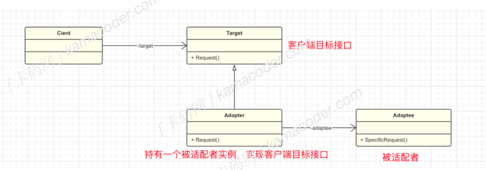

# 适配器模式
## 什么是适配器模式
适配器模式Adapter是一种结构型设计模式，它可以将一个类的接口转换成客户希望的另一个接，主要目的是充当两个不同接口之间的桥梁，使得原本接口不兼容的类能够一起工作。

## 基本结构
适配器模式分为一下几个基本角色
>可以把适配器模式理解成拓展坞，起到转接的作用，原有的接口是USB，但是客户端需要使用type-c，使用拓展坞提供一个`type-c`接口给客户端使用。



- 目标接口`Target`:客户端希望使用的接口
- 适配器类`Adapter`:实现客户端使用的目标接口，持有一个需要适配的类实例。
- 被适配者`Adaptee`:需要适配的类。

这样，客户端就可以使用目标接口，而不需要对原来的`Adaptee`进行修改，`Adapter`起到一个转接扩展的作用。

## 应用场景
在开发过程中，适配器模式往往扮演者‘补救’和‘扩展’的角色：
- 当使用一个已经存在的类，但是他的接口与你的代码不符合时，可以使用适配器模式。
- 在系统扩展阶段需要增减新的类时，并且类的接口和系统现有的类不一致时，可以使用适配器模式。

>##### 使用配置器模式可以将客户端代码与具体的类解耦，客户端代码不需要知道被适配者的细节，客户端代码也不需要修改，这使得它具有良好的扩展性，但是这也势必导致系统变得更加复杂。

## 代码示例
```cpp
#include <iostream>
using namespace std;

// usb接口
class usb
{
public:
    virtual void charge() = 0;
};

// TypeC接口
class TypeC
{
public:
    virtual void chargeWithTypeC() = 0;
};

// 适配器类
class TypeCAdapter : public usb
{
private:
    TypeC *typeC;

public:
    TypeCAdapter(TypeC *typeC) : typeC(typeC) {}
    void charge() override
    {
        typeC->chargeWithTypeC();
    }
};

// 新电脑类，使用TypeC接口
class NewComputer : public TypeC
{
public:
    void chargeWithTypeC() override
    {
        cout << "TypeC" << endl;
    }
};

// 适配器充电器类，使用usb接口
class AdapterCharger : public usb
{
public:
    void charge() override
    {
        cout << "usb adapter" << endl;
    }
};

int main()
{
    int N;
    cin >> N;
    cin.ignore(); // 消耗换行符
    for (int i = 0; i < N; i++)
    {
        // 读取用户选择
        int choice;
        cin >> choice;

        // 根据用户的选择创建相应对象
        if (choice == 1)
        {
            TypeC *newComputer = new NewComputer();
            newComputer->chargeWithTypeC();
            delete newComputer;
        }
        else if (choice == 2)
        {
            usb *usbAdapter = new AdapterCharger();
            usbAdapter->charge();
            delete usbAdapter;
        }
    }
    return 0;
}


```
